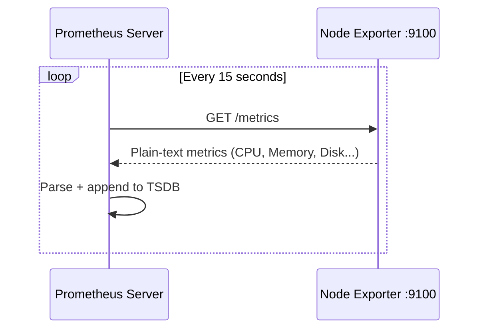
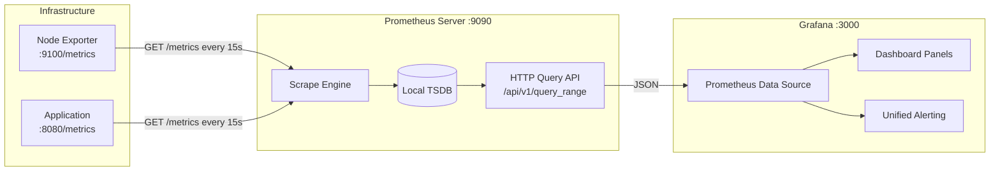
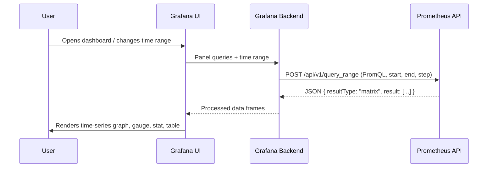

When you first encounter a monitoring stack with dashboards full of live CPU graphs and memory gauges, it can feel like magic. Open the Grafana UI and data is just *there*. But underneath, there are two distinct tools doing very different jobs, connected by a clean, deliberate API boundary. This essay breaks that apart.

---

## What Prometheus Is

Prometheus is an **open-source monitoring system and time-series database**, originally built at SoundCloud in 2012 and later donated to the Cloud Native Computing Foundation (CNCF). It is now the de facto standard for metrics collection in cloud-native environments.

At its core, Prometheus is three things working together:

1. **A scrape engine** — it periodically makes HTTP GET requests to application endpoints to collect metrics.
2. **A time-series database (TSDB)** — it stores those metrics locally on disk, indexed by metric name and labels.
3. **A query engine** — it evaluates PromQL queries against the stored data, and exposes results over an HTTP API.

Prometheus deliberately has no built-in dashboard or visualization layer. It has a minimal expression browser for running ad-hoc queries, but that is not meant for production use. Prometheus's job is to collect data accurately and serve it reliably. Display is someone else's problem.

### The Pull Model

One of Prometheus's defining architectural choices is its **pull-based collection model**. Most traditional monitoring systems (like Graphite with StatsD) use a push model — applications actively send metrics to a central collector. Prometheus inverts this.

Instead of applications pushing metrics to Prometheus, **Prometheus reaches out and pulls metrics from applications on a fixed schedule**. Applications expose their current internal state at an HTTP endpoint (conventionally `/metrics`), and Prometheus scrapes that endpoint at a configurable interval (default: 15 seconds).

This has important operational consequences:

- **The monitoring server controls the load.** If a target is misbehaving and sending excessive data in a push model, it can overwhelm the collector. In a pull model, the scrape interval is a hard rate limit — no target can "flood" Prometheus.
- **Target health is implicit.** If a scrape fails (connection refused, timeout), Prometheus immediately knows the target is down. You don't need a separate heartbeat mechanism.
- **The `/metrics` endpoint is self-documenting.** Anyone can `curl` it to see exactly what an application is reporting, without touching Prometheus at all.

---

## How Prometheus Collects and Stores Metrics

### Step 1: The Exposition Format

Applications (or exporters like Node Exporter) expose metrics as plain text over HTTP. The format is simple:

```plaintext
# HELP node_cpu_seconds_total Seconds the CPUs spent in each mode.
# TYPE node_cpu_seconds_total counter
node_cpu_seconds_total{cpu="0",mode="idle"} 12345.67
node_cpu_seconds_total{cpu="0",mode="system"} 234.56
node_cpu_seconds_total{cpu="1",mode="idle"} 11987.03
node_cpu_seconds_total{cpu="1",mode="system"} 201.44

# HELP node_memory_MemFree_bytes Number of bytes of memory available.
# TYPE node_memory_MemFree_bytes gauge
node_memory_MemFree_bytes 2.147e+09
```

Each line has three parts:
- **Metric name**: `node_cpu_seconds_total`
- **Labels** (key-value pairs in `{}`): `cpu="0",mode="idle"` — these are what make Prometheus *multi-dimensional*. The same metric name can represent dozens of different time series, distinguished by their labels.
- **Value**: a floating-point number representing the current measurement.

Two comment lines precede each metric family:
- `# HELP` — a human-readable description
- `# TYPE` — declares whether the metric is a counter, gauge, histogram, or summary

### Step 2: Scraping

Prometheus's scrape engine reads `prometheus.yml` to know which targets to scrape and when:

```yaml
global:
  scrape_interval: 15s       # Default: scrape every 15 seconds
  evaluation_interval: 15s   # Default: evaluate alert rules every 15 seconds

scrape_configs:
  - job_name: "node_exporter"
    static_configs:
      - targets: ["192.168.1.10:9100"]

  - job_name: "prometheus"
    static_configs:
      - targets: ["localhost:9090"]
```

At each `scrape_interval`, the scrape engine makes an HTTP GET to `http://192.168.1.10:9100/metrics`. The response is plain text, parsed according to the exposition format, and each metric-label combination becomes a **time series** — a sequence of `(timestamp, value)` pairs stored in the TSDB.



### Step 3: Storage in the TSDB

Prometheus stores data in its local **Time Series Database (TSDB)**, a custom storage engine optimized for append-heavy write patterns and range-scan read patterns. Data is stored in compressed chunks on disk, organized into 2-hour blocks.

Each unique combination of metric name and label set is a separate time series. For example:

| Time Series | Labels |
|---|---|
| `node_cpu_seconds_total` | `{cpu="0", mode="idle", instance="192.168.1.10:9100", job="node_exporter"}` |
| `node_cpu_seconds_total` | `{cpu="0", mode="system", instance="192.168.1.10:9100", job="node_exporter"}` |
| `node_cpu_seconds_total` | `{cpu="1", mode="idle", instance="192.168.1.10:9100", job="node_exporter"}` |

Notice that Prometheus automatically appends `instance` and `job` labels from the scrape configuration. This is how it tracks *which target* a metric came from.

By default, data is retained for **15 days** before being deleted. This is configurable via `--storage.tsdb.retention.time`.

### Step 4: PromQL — The Query Language

Raw time series stored in the TSDB are not very useful on their own. PromQL (Prometheus Query Language) is how you extract meaningful information.

**Counters always increase.** A metric like `node_cpu_seconds_total` is a monotonically increasing counter — it never resets (unless the process restarts). To get a meaningful "CPU usage right now," you need to compute the *rate of change*:

```promql
rate(node_cpu_seconds_total{mode="system"}[5m])
```

This calculates the per-second average rate of increase over the last 5 minutes — effectively the CPU time being consumed per second in system mode.

**Deriving CPU percentage:**

```promql
100 * (1 - avg by(instance)(rate(node_cpu_seconds_total{mode="idle"}[5m])))
```

This takes the rate of idle CPU time, averages it across all CPU cores, and subtracts from 100 to get the percentage of time the CPU is *not* idle.

**Memory in use:**

```promql
100 * (1 - ((node_memory_MemFree_bytes + node_memory_Cached_bytes + node_memory_Buffers_bytes) / node_memory_MemTotal_bytes))
```

PromQL is evaluated by Prometheus's query engine against the stored TSDB. Results are returned over its HTTP API — which is precisely how Grafana gets its data.

---

## What Grafana Is

Grafana is an **open-source data visualization and analytics platform**. It does not store metrics itself. It does not scrape targets. It has no notion of what a "counter" or "gauge" is at the storage level.

What Grafana does is query data sources and render the results visually. It supports dozens of data sources: Prometheus, InfluxDB, Elasticsearch, PostgreSQL, CloudWatch, and many others. Each data source has a plugin that knows how to speak that system's query language.

When Prometheus is configured as a Grafana data source, Grafana's Prometheus plugin issues PromQL queries to Prometheus's HTTP API and maps the JSON responses to visual panels.

This is the key insight: **Grafana is essentially a sophisticated HTTP client that issues PromQL queries and renders the results.**

---

## How Grafana Accesses Data from Prometheus

### The Architecture



### Step 1: Configuring the Data Source

In Grafana, under `Configuration → Data Sources → Add data source`, you select Prometheus and provide its address. A minimal configuration:

| Setting | Value | Purpose |
|---|---|---|
| **URL** | `http://localhost:9090` | The Prometheus HTTP API endpoint |
| **Scrape interval** | `15s` | Should match `prometheus.yml` — used for query resolution hints |
| **HTTP Method** | `POST` | Preferred for large queries to avoid URL length limits |
| **Access** | `Server` | Grafana's backend makes the API call, not the user's browser |

### Step 2: The Range Query

When you open a Grafana dashboard, each panel issues a PromQL query to Prometheus's **range query** API endpoint. Grafana translates the dashboard's time picker into Unix epoch timestamps and calculates a `step` (resolution) based on the panel's pixel width:

```http
POST http://localhost:9090/api/v1/query_range
Content-Type: application/x-www-form-urlencoded

query=rate(node_cpu_seconds_total{mode="system"}[5m])
&start=1716200000
&end=1716203600
&step=60
```

The `step` is critical — a panel that is 600 pixels wide displaying 1 hour of data will use a step of 6 seconds, requesting exactly 600 data points so each pixel maps to one sample. Grafana computes this automatically.

### Step 3: The Prometheus JSON Response

Prometheus evaluates the PromQL query against the TSDB and returns structured JSON:

```json
{
  "status": "success",
  "data": {
    "resultType": "matrix",
    "result": [
      {
        "metric": {
          "cpu": "0",
          "mode": "system",
          "instance": "192.168.1.10:9100",
          "job": "node_exporter"
        },
        "values": [
          [1716200000, "0.023"],
          [1716200060, "0.031"],
          [1716200120, "0.019"]
        ]
      }
    ]
  }
}
```

`resultType: "matrix"` means this is a range query result — a set of time series, each containing an array of `[timestamp, value]` pairs. For an instant query (`/api/v1/query`), the `resultType` would be `"vector"` and each series has a single `value` instead of `values`.

### Step 4: Grafana's Rendering Pipeline

Grafana's backend receives this JSON and hands it to the panel renderer:



The UI layer then:
- Maps timestamps to the X-axis
- Maps values to the Y-axis
- Applies panel-level **unit formatting** (e.g., bytes → GiB, raw ratio → percentage)
- Applies **transformations** (join multiple queries, rename series, calculate derived fields)
- Renders the final visualization

### Instant vs. Range Queries

Grafana uses two different Prometheus API endpoints depending on the panel type:

| Panel Type | API Endpoint | Query Type |
|---|---|---|
| Time-series graph, bar chart, heatmap | `/api/v1/query_range` | Range — returns arrays of `[timestamp, value]` |
| Stat panel, Gauge, single-value display | `/api/v1/query` | Instant — returns a single current value |

A **Stat** panel showing current CPU usage issues:
```http
GET /api/v1/query?query=100 - (avg(rate(node_cpu_seconds_total{mode="idle"}[5m])) * 100)&time=1716203600
```

A **Time Series** panel for the same metric over the last hour issues:
```http
POST /api/v1/query_range?query=...&start=1716200000&end=1716203600&step=6
```

### Template Variables: Dynamic Dashboards

One of Grafana's most powerful features is **template variables** — parameterized queries that populate UI dropdowns. Instead of building one dashboard per server, you define a variable:

- **Variable name:** `instance`
- **Type:** Query
- **Data source:** Prometheus
- **Query:** `label_values(node_cpu_seconds_total, instance)`

This calls `/api/v1/label/instance/values`, which returns all unique values for the `instance` label currently in the TSDB (e.g., `192.168.1.10:9100`, `192.168.1.11:9100`). Grafana renders this as a dropdown.

Every panel query is then parameterized:
```promql
rate(node_cpu_seconds_total{instance="$instance", mode="system"}[5m])
```

When the user selects a different instance, Grafana re-issues all panel queries with the new value. A single dashboard serves an entire fleet.

---

## Alerting: Where the Two Systems Meet

The stack supports two alerting models, and understanding the distinction matters operationally:

**Classic: Prometheus + Alertmanager**

Prometheus evaluates alert rules from `rule_files` on each `evaluation_interval`. When a rule's PromQL expression is true for longer than the `for` duration, it fires an alert to Alertmanager, which handles routing, grouping, and silencing:

```yaml
# rules/node_alerts.yml
groups:
  - name: node_health
    rules:
      - alert: HighCPUUsage
        expr: 100 - (avg by(instance)(rate(node_cpu_seconds_total{mode="idle"}[5m])) * 100) > 85
        for: 5m
        labels:
          severity: warning
        annotations:
          summary: "High CPU on {{ $labels.instance }}"
```

**Modern: Grafana Unified Alerting**

Grafana can now run its own alert evaluation engine. It issues PromQL queries against Prometheus at a defined interval and manages notification routing via its own contact points — eliminating the need for a separate Alertmanager instance.

| Capability | Prometheus + Alertmanager | Grafana Unified Alerting |
|---|---|---|
| Alert rules live | In `rules/*.yml` files | In Grafana UI |
| Notification routing | Alertmanager config | Grafana contact points |
| Multi-datasource alerts | No | Yes |
| Silences & inhibition | Alertmanager UI | Grafana UI |

---

## The Clean Division of Responsibility

The reason Prometheus and Grafana work so well together is that they solve different problems and are deliberately ignorant of each other's internals. Prometheus doesn't know or care whether Grafana is running. Grafana doesn't know how Prometheus stores data internally — it only knows the HTTP API contract.

This is the architecture pattern at work: a purpose-built **data plane** (Prometheus: collect, store, query) decoupled from a purpose-built **presentation plane** (Grafana: visualize, explore, alert). The API is the seam. Either component can be swapped out — Grafana can query VictoriaMetrics or Thanos using the same PromQL API; Prometheus data can be visualized in other tools.

Understanding this boundary is what lets you debug the stack intelligently. A missing panel is either a Prometheus query problem (PromQL syntax, missing labels, stale data) or a Grafana rendering problem (wrong unit, time zone, transformation). Knowing which side of the API the problem lives on cuts debugging time in half.

---

## Reflection

When I first set up this stack, I treated Grafana and Prometheus as a single monolith. I'd see a dashboard light up with data and assume they were deeply integrated. Digging into how they actually communicate — a plain HTTP POST with a PromQL string, receiving structured JSON back — removed all the mystery.

The more important realization was architectural: this is what good system design looks like. Two tools, each excellent at one thing, connected by a stable API. Neither is responsible for what the other does. The complexity of the full stack (service discovery, cardinality management, alert routing, dashboard templating) is manageable precisely because each concern is isolated.

For anyone working in DevOps or infrastructure engineering, truly understanding this data flow — from the raw text at `/metrics`, through the TSDB, through a PromQL range query, into a JSON matrix, and finally onto a rendered graph — is the difference between operating a monitoring stack and understanding one.

---

**Related reading**

- [Setting Up Prometheus and Grafana for Linux Server Monitoring](/labs/linux-monitoring-stack) — the hands-on companion to this essay. Install the stack, write the config, and watch the data flow in real time.
- [PromQL Cheat Sheet](/notes/promql-cheat-sheet) — a quick reference for the queries covered in this essay.
- [Why Monitoring Became Complex](/essays/why-monitoring-became-complex) — the historical context for why this stack exists and why monitoring tooling evolved to this level of sophistication.
