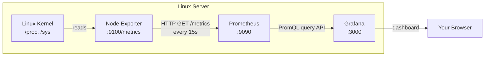

This lab builds a complete, production-aware monitoring stack on a Linux server. By the end, you will have a live Grafana dashboard displaying CPU usage, memory pressure, disk I/O, and network traffic — collected by Prometheus every 15 seconds from a Node Exporter agent running on the same machine.

This is a companion to the essay *Flying Blind: The Infrastructure Problem That Built Modern Observability*, which covers the conceptual foundation. This lab covers the implementation.

---

## What We Are Building

Three components, one monitoring pipeline:

```
Linux Server
    │
    ├── Node Exporter  (port 9100)
    │       Reads /proc, /sys — exposes metrics as HTTP text
    │
    ├── Prometheus     (port 9090)
    │       Scrapes Node Exporter every 15s, stores in TSDB
    │       Serves PromQL query API
    │
    └── Grafana        (port 3000)
            Queries Prometheus via HTTP API
            Renders dashboards in the browser
```

Each component is a separate process. They communicate over localhost HTTP. No component stores data on behalf of another — Prometheus is the only one that writes to disk.



---

## Requirements

- **OS**: Ubuntu 22.04 LTS or Ubuntu 24.04 LTS (commands are Debian/Ubuntu-specific)
- **Access**: A user account with `sudo` privileges
- **Network**: Internet access to download binaries
- **Ports**: 9100, 9090, and 3000 should be reachable (open in firewall if applicable)
- **Resources**: 1 CPU, 1GB RAM minimum — this stack runs comfortably on a small VM or VPS

> If running on a cloud instance (AWS, GCP, DigitalOcean), ensure your security group or firewall rules allow inbound TCP on ports 9090 and 3000 from your IP. Port 9100 (Node Exporter) should remain restricted to localhost unless you have specific multi-server requirements.

---

## Step 1 — Installing Node Exporter

Node Exporter is the agent that reads Linux kernel metrics and exposes them over HTTP. It runs as a lightweight background service with no external dependencies.

### Download and Install the Binary

```bash
# Download the latest Node Exporter release
wget https://github.com/prometheus/node_exporter/releases/download/v1.8.2/node_exporter-1.8.2.linux-amd64.tar.gz

# Extract the archive
tar -xvf node_exporter-1.8.2.linux-amd64.tar.gz

# Move the binary to a system-wide location
sudo mv node_exporter-1.8.2.linux-amd64/node_exporter /usr/local/bin/

# Clean up the extracted directory
rm -rf node_exporter-1.8.2.linux-amd64 node_exporter-1.8.2.linux-amd64.tar.gz
```

### Create a Dedicated System User

Running services as a dedicated user with no login shell and no home directory is a security best practice. If the process is compromised, the attacker has no shell to work with and no home directory to plant files in.

```bash
sudo useradd --no-create-home --shell /bin/false node_exporter
```

### Create the systemd Service

systemd is Linux's service manager. Defining Node Exporter as a systemd service means it starts automatically on boot, restarts on failure, and can be managed with `systemctl`.

```bash
sudo tee /etc/systemd/system/node_exporter.service << 'EOF'
[Unit]
Description=Node Exporter
Documentation=https://github.com/prometheus/node_exporter
After=network.target

[Service]
User=node_exporter
Group=node_exporter
Type=simple
ExecStart=/usr/local/bin/node_exporter
Restart=on-failure
RestartSec=5s

[Install]
WantedBy=multi-user.target
EOF
```

### Enable and Start the Service

```bash
sudo systemctl daemon-reload
sudo systemctl enable node_exporter
sudo systemctl start node_exporter
sudo systemctl status node_exporter
```

Expected output:
```
● node_exporter.service - Node Exporter
     Loaded: loaded (/etc/systemd/system/node_exporter.service; enabled)
     Active: active (running) since ...
```

### Verify the Metrics Endpoint

```bash
curl http://localhost:9100/metrics | head -40
```

You should see output like this:

```
# HELP go_gc_duration_seconds A summary of the pause duration of garbage collection cycles.
# HELP node_cpu_seconds_total Seconds the CPUs spent in each mode.
# TYPE node_cpu_seconds_total counter
node_cpu_seconds_total{cpu="0",mode="idle"} 12345.67
node_cpu_seconds_total{cpu="0",mode="iowait"} 23.45
node_cpu_seconds_total{cpu="0",mode="system"} 234.56
node_cpu_seconds_total{cpu="0",mode="user"} 456.78
# HELP node_memory_MemFree_bytes Number of bytes of memory available.
# TYPE node_memory_MemFree_bytes gauge
node_memory_MemFree_bytes 2.147e+09
```

This plain-text output is the Prometheus exposition format. Every line is a metric. Node Exporter is working.

---

## Step 2 — Installing Prometheus

Prometheus is the core of the monitoring stack. It scrapes Node Exporter, stores the data, and serves queries.

### Create the Prometheus User and Directories

```bash
# Dedicated user — same principle as Node Exporter
sudo useradd --no-create-home --shell /bin/false prometheus

# Configuration directory (prometheus.yml lives here)
sudo mkdir /etc/prometheus

# Data directory (the TSDB is stored here)
sudo mkdir /var/lib/prometheus
```

### Download and Install Binaries

```bash
wget https://github.com/prometheus/prometheus/releases/download/v2.52.0/prometheus-2.52.0.linux-amd64.tar.gz

tar -xvf prometheus-2.52.0.linux-amd64.tar.gz

# Install the two main binaries
sudo mv prometheus-2.52.0.linux-amd64/prometheus /usr/local/bin/
sudo mv prometheus-2.52.0.linux-amd64/promtool /usr/local/bin/

# Install the console assets (optional but recommended)
sudo mv prometheus-2.52.0.linux-amd64/consoles /etc/prometheus/
sudo mv prometheus-2.52.0.linux-amd64/console_libraries /etc/prometheus/

rm -rf prometheus-2.52.0.linux-amd64 prometheus-2.52.0.linux-amd64.tar.gz
```

`promtool` is Prometheus's command-line utility — useful for checking configuration file syntax before restarting the service.

### Write the Configuration File

`prometheus.yml` is the heart of the Prometheus configuration. Create it now:

```bash
sudo tee /etc/prometheus/prometheus.yml << 'EOF'
global:
  # How often Prometheus scrapes each target
  scrape_interval: 15s

  # How often Prometheus evaluates alerting rules
  evaluation_interval: 15s

# Scrape jobs define what to monitor
scrape_configs:

  # Prometheus monitors itself — useful for tracking its own performance
  - job_name: "prometheus"
    static_configs:
      - targets: ["localhost:9090"]

  # Node Exporter — Linux system metrics
  - job_name: "node_exporter"
    static_configs:
      - targets: ["localhost:9100"]
EOF
```

**Understanding the key sections:**

| Section | Purpose |
|---|---|
| `global.scrape_interval` | Every 15 seconds, Prometheus makes an HTTP GET to every target's `/metrics` endpoint. Lower = more resolution, more storage. |
| `global.evaluation_interval` | How often alert rules are evaluated (covered in Future Improvements). |
| `scrape_configs` | A list of *jobs*. Each job defines a group of targets to scrape. Targets in the same job share labels like `job="node_exporter"`. |
| `static_configs.targets` | The `host:port` addresses to scrape. For multi-server setups, add more entries here. |

Validate the config before proceeding:

```bash
promtool check config /etc/prometheus/prometheus.yml
```

Expected: `SUCCESS: /etc/prometheus/prometheus.yml is valid prometheus config file syntax`

### Set Ownership

```bash
sudo chown -R prometheus:prometheus /etc/prometheus /var/lib/prometheus
sudo chown prometheus:prometheus /usr/local/bin/prometheus /usr/local/bin/promtool
```

### Create the systemd Service

```bash
sudo tee /etc/systemd/system/prometheus.service << 'EOF'
[Unit]
Description=Prometheus Monitoring System
Documentation=https://prometheus.io/docs/introduction/overview/
After=network.target

[Service]
User=prometheus
Group=prometheus
Type=simple
ExecStart=/usr/local/bin/prometheus \
  --config.file=/etc/prometheus/prometheus.yml \
  --storage.tsdb.path=/var/lib/prometheus/ \
  --storage.tsdb.retention.time=15d \
  --web.console.templates=/etc/prometheus/consoles \
  --web.console.libraries=/etc/prometheus/console_libraries \
  --web.listen-address=0.0.0.0:9090
Restart=on-failure
RestartSec=5s

[Install]
WantedBy=multi-user.target
EOF
```

The `--storage.tsdb.retention.time=15d` flag tells Prometheus to keep 15 days of data before deleting older samples. Adjust this based on your available disk space.

### Enable and Start

```bash
sudo systemctl daemon-reload
sudo systemctl enable prometheus
sudo systemctl start prometheus
sudo systemctl status prometheus
```

### Verify Targets

Open `http://<server-ip>:9090/targets` in your browser.

> [ Screenshot Placeholder — Prometheus Targets page showing both `prometheus` and `node_exporter` jobs with State: UP ]

Both jobs should show **State: UP**. If a target shows **DOWN**, the endpoint is not reachable — check that the service is running and no firewall is blocking the port.

You can also run a quick query in the Prometheus expression browser at `http://<server-ip>:9090/graph`:

```promql
up
```

This returns `1` for every target that is successfully being scraped, and `0` for any that are down.

---

## Step 3 — Installing Grafana

Grafana is installed from its official APT repository, which handles updates automatically.

```bash
# Install required packages
sudo apt-get install -y apt-transport-https software-properties-common wget

# Add Grafana's GPG key
sudo mkdir -p /etc/apt/keyrings/
wget -q -O - https://apt.grafana.com/gpg.key | gpg --dearmor | \
  sudo tee /etc/apt/keyrings/grafana.gpg > /dev/null

# Add the Grafana stable repository
echo "deb [signed-by=/etc/apt/keyrings/grafana.gpg] https://apt.grafana.com stable main" | \
  sudo tee -a /etc/apt/sources.list.d/grafana.list

# Update and install
sudo apt-get update
sudo apt-get install -y grafana

# Enable and start
sudo systemctl daemon-reload
sudo systemctl enable grafana-server
sudo systemctl start grafana-server
sudo systemctl status grafana-server
```

### Log In to Grafana

Open `http://<server-ip>:3000` in your browser.

- **Username**: `admin`
- **Password**: `admin`

Grafana will prompt you to change the password on first login. Do this — even for lab environments, it's a good habit.

> [ Screenshot Placeholder — Grafana login page ]

---

## Step 4 — Connecting Prometheus as a Data Source

Grafana needs to know where Prometheus is before it can query it.

1. In the left sidebar, go to **Connections → Data Sources**
2. Click **Add data source**
3. Select **Prometheus**
4. Set the **URL** to `http://localhost:9090`
5. Leave all other settings at their defaults
6. Click **Save & test**

You should see: **"Successfully queried the Prometheus API."**

> [ Screenshot Placeholder — Grafana data source configuration page showing Prometheus URL ]

If the test fails, check that Prometheus is running (`systemctl status prometheus`) and that Grafana can reach port 9090 on localhost.

---

## Step 5 — Importing a Dashboard

Building a dashboard from scratch takes time. The Grafana dashboard marketplace contains pre-built, community-maintained dashboards for common exporters. For Node Exporter, the gold standard is **Node Exporter Full**, dashboard ID `1860`.

1. In the left sidebar, go to **Dashboards → Import**
2. Enter `1860` in the **Import via grafana.com** field
3. Click **Load**
4. Under **Prometheus**, select the Prometheus data source you just configured
5. Click **Import**

> [ Screenshot Placeholder — Grafana dashboard import screen with ID 1860 ]

You will be taken directly to a comprehensive dashboard showing CPU usage, memory usage, disk I/O, network traffic, system load, filesystem usage, and more — all populated with live data from your server.

> [ Screenshot Placeholder — Node Exporter Full dashboard showing live CPU and memory metrics ]

Take a moment to explore the dashboard. Notice the dropdowns at the top — `job` and `instance`. These are Grafana template variables, populated dynamically from Prometheus labels. In a multi-server setup, you would select different servers from the `instance` dropdown to view their metrics on the same dashboard.

---

## Step 6 — PromQL Basics

The dashboard you imported uses pre-written PromQL queries. Understanding how those queries work is what allows you to customize dashboards, write your own, and debug unexpected values.

Open the Prometheus expression browser at `http://<server-ip>:9090/graph` and try these queries.

### CPU Usage Percentage

Node Exporter exposes CPU time as a counter — `node_cpu_seconds_total` — that increases monotonically. To get the *rate* of CPU time being consumed right now, use the `rate()` function over a 5-minute window:

```promql
100 - (avg by(instance)(rate(node_cpu_seconds_total{mode="idle"}[5m])) * 100)
```

This calculates: the rate of idle CPU time, averaged across all cores, subtracted from 100 to get the percentage of time the CPU is actually doing work.

**Why `rate()` instead of the raw value?** Because `node_cpu_seconds_total` is a counter that only increases. The raw value tells you how many CPU seconds have elapsed since boot — not useful for "what is CPU usage right now." `rate()` computes the per-second average increase over the last 5 minutes, which is what you actually want.

### Memory Usage Percentage

```promql
100 * (1 - (
  (node_memory_MemFree_bytes + node_memory_Cached_bytes + node_memory_Buffers_bytes)
  / node_memory_MemTotal_bytes
))
```

Linux reports memory in multiple categories. `MemFree` is memory not used for anything. `Cached` and `Buffers` are memory used for disk caching — technically "used" but immediately available to applications on demand. This query treats cached and buffered memory as effectively free, which matches how `free -h` reports memory.

### Available Disk Space

```promql
node_filesystem_avail_bytes{mountpoint="/", fstype!="tmpfs"}
```

Labels filter which time series you want. `mountpoint="/"` selects only the root filesystem. `fstype!="tmpfs"` excludes in-memory temporary filesystems, which would skew the result.

### Network Traffic Rate

```promql
rate(node_network_receive_bytes_total{device="eth0"}[5m])
```

Replace `eth0` with your actual network interface name (find it with `ip link show`). This gives you bytes received per second, averaged over 5 minutes.

### Current System Load

```promql
node_load1
```

This is the 1-minute load average — the same value shown by `uptime` or `top`. A load average equal to the number of CPU cores means the CPUs are fully saturated.

---

## Step 7 — Reading What the Data Says

Knowing how to write queries is different from knowing how to interpret results. This section covers how to read the most common signals.

### CPU Spikes

A sudden spike in CPU usage is normal and expected — a backup job, a compilation, a search index rebuild. What matters is:

- **Duration**: a 30-second spike is different from 20 minutes of sustained high CPU
- **Correlation**: did the spike coincide with a deployment, a cron job, or elevated traffic?
- **Core distribution**: is one core saturated while others are idle? That suggests a single-threaded bottleneck.

In Grafana, set the dashboard time range to "Last 24 hours" and look for the shape of CPU usage over time. A flat line near 100% suggests the server is consistently overloaded. Periodic spikes at regular intervals suggest scheduled jobs. Spikes that coincide with traffic patterns are expected behavior.

### Memory Pressure

Memory usage trending steadily upward over hours or days without leveling off is the signature of a memory leak. The application is allocating memory and not releasing it.

Watch for:

- **Swap usage** (`node_memory_SwapUsed_bytes`): if swap is in use, the system is under memory pressure. Swap is significantly slower than RAM, and swap usage causes application latency.
- **OOM events**: if the out-of-memory killer terminates processes, check system logs with `journalctl -k | grep -i oom`.

### Disk Bottlenecks

High disk I/O wait (`node_cpu_seconds_total{mode="iowait"}`) combined with high disk utilization suggests a storage bottleneck. Applications waiting on disk reads or writes appear "slow" even when CPU is available.

Disk issues often manifest as elevated I/O wait on the CPU metrics before disk saturation becomes obvious on its own.

### Network Usage

Sustained high outbound network traffic can indicate a data exfiltration issue, a misconfigured backup job, or a service generating more traffic than expected. Correlate network spikes with application logs to identify the source.

---

## Step 8 — Troubleshooting

Real infrastructure always encounters problems. These are the most common issues and how to resolve them.

### Target shows "DOWN" in Prometheus

Check that the service is running:
```bash
systemctl status node_exporter
```

Check if the port is accessible:
```bash
curl -v http://localhost:9100/metrics
```

Check for firewall issues (if applicable):
```bash
sudo ufw status
sudo iptables -L -n | grep 9100
```

Check Prometheus logs for the specific error:
```bash
journalctl -u prometheus -f
```

### Prometheus fails to start — YAML syntax error

Prometheus is strict about YAML indentation (spaces, not tabs). Validate the config before restarting:
```bash
promtool check config /etc/prometheus/prometheus.yml
```

The error output will indicate the line and the specific problem.

### Grafana "Data source connected but no labels received"

This usually means Prometheus has no data yet. Wait 60 seconds after starting Prometheus — it needs at least one scrape cycle to have data to return. Then re-test the data source.

### Grafana panels show "No data"

Check the time range (top right of the dashboard). If it is set to "Last 5 minutes" and Prometheus only started 2 minutes ago, there is genuinely no data in that range yet. Set the range to "Last 15 minutes" and try again.

Also verify the data source is correctly configured — go to **Connections → Data Sources** and click **Save & test**.

### "Permission denied" errors when starting services

If any service fails with permission denied errors, the ownership of files or directories may be incorrect:
```bash
sudo chown -R prometheus:prometheus /etc/prometheus /var/lib/prometheus
sudo chown -R node_exporter:node_exporter /usr/local/bin/node_exporter
```

---

## Step 9 — Verifying the Complete Stack

Run through this checklist to confirm everything is working end-to-end:

```bash
# All three services should show "active (running)"
systemctl status node_exporter prometheus grafana-server
```

```bash
# Node Exporter is exposing metrics
curl -s http://localhost:9100/metrics | grep node_cpu_seconds_total | head -3
```

```bash
# Prometheus is scraping successfully (returns 1 for UP targets)
curl -s 'http://localhost:9090/api/v1/query?query=up' | python3 -m json.tool
```

Open `http://<server-ip>:3000` and confirm the Node Exporter Full dashboard is displaying live data.

> [ Screenshot Placeholder — Final working Grafana dashboard with CPU, memory, disk, and network panels all displaying data ]

---

## Future Improvements

This lab establishes the foundation. These are the natural next steps.

**Alerting with Alertmanager**

Prometheus can evaluate alert rules and fire notifications when thresholds are breached. Alertmanager handles routing those notifications to Slack, PagerDuty, email, or other channels. Without alerting, monitoring is passive — you only see problems when you look at the dashboard. With alerting, the monitoring system comes to you.

A simple CPU alert rule would look like:
```yaml
# /etc/prometheus/rules/node_alerts.yml
groups:
  - name: node
    rules:
      - alert: HighCPU
        expr: 100 - (avg by(instance)(rate(node_cpu_seconds_total{mode="idle"}[5m])) * 100) > 85
        for: 5m
        annotations:
          summary: "High CPU on {{ $labels.instance }}"
```

**Log Aggregation with Loki**

Prometheus handles metrics. Loki — also from Grafana Labs — handles logs in a Prometheus-compatible model. Adding Loki to your stack gives you the ability to correlate metric anomalies with log events in the same Grafana interface.

**Multi-server Monitoring**

The configuration we built monitors a single server. For multiple servers, add each Node Exporter address to the `scrape_configs` targets list in `prometheus.yml`. The `instance` label automatically differentiates between servers on the dashboard.

**Blackbox Exporter**

While Node Exporter monitors the machine, Blackbox Exporter monitors external endpoints — checking whether an HTTP endpoint returns 200, whether an SSL certificate expires within 30 days, whether a DNS name resolves correctly. Essential for user-facing availability monitoring.

**Kubernetes Monitoring**

For containerized workloads, Prometheus's native Kubernetes service discovery can automatically find and scrape pods across a cluster. The `kube-state-metrics` exporter and `cAdvisor` provide pod-level metrics comparable to what Node Exporter provides at the system level.

---

## What You Built

In this lab, you:

- Installed Node Exporter and configured it to expose Linux kernel metrics as HTTP text
- Installed Prometheus and configured it to scrape Node Exporter every 15 seconds
- Wrote and validated a `prometheus.yml` scrape configuration
- Installed Grafana and connected it to Prometheus as a data source
- Imported a production-quality monitoring dashboard
- Wrote PromQL queries for CPU, memory, disk, and network metrics
- Understood how to read common metric patterns

Your server now has complete visibility into its own behavior. CPU spikes, memory trends, disk saturation, and network traffic are all captured, stored, and visualized continuously — without you needing to SSH in and run `top` to find out what is happening.

That shift — from reactive, manual inspection to continuous, automated visibility — is what monitoring means in practice.

The companion essay, *Flying Blind*, covers why this capability became necessary and how the tools that provide it were developed. The two articles together give you both the conceptual foundation and the operational practice.
