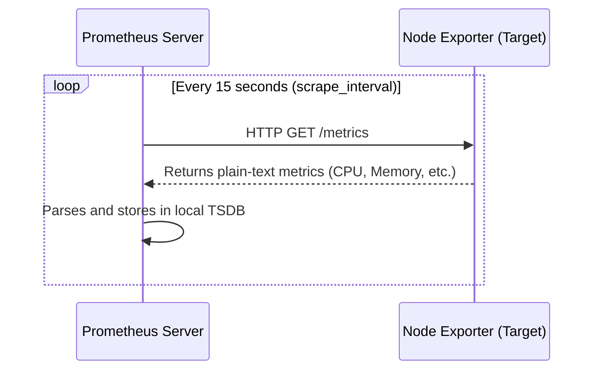

## Objective of the Code Analysis

While deploying monitoring infrastructure is straightforward, understanding *how* it operates beneath the surface is what differentiates a junior operator from a senior systems engineer. The objective of this analysis is to dissect the Prometheus monitoring stack—specifically focusing on its core configuration file (`prometheus.yml`), the scrape mechanics, and the querying language (PromQL).

Instead of analyzing a standalone script, we are analyzing an infrastructure-as-code configuration and a distributed system flow. This helps in grasping real-world observability principles.

---

## Metric Collection Flow & How Prometheus Scraping Works

Prometheus does not wait for applications to push metrics to it. Instead, it uses a **pull-based** mechanism.

1. **Exposition:** Target applications (like Node Exporter or a web server) expose their current internal state via an HTTP endpoint, typically `/metrics`.
2. **Service Discovery:** Prometheus discovers these targets dynamically (e.g., querying the Kubernetes API) or via static configuration.
3. **Scraping:** Periodically, Prometheus makes an HTTP GET request to the target's `/metrics` endpoint.
4. **Storage:** The plain-text metrics are parsed and appended to Prometheus's local Time Series Database (TSDB).



### How Node Exporter Exposes Metrics

If you inspect the output of a Node Exporter `/metrics` page, it looks like this:

```plaintext
# HELP node_cpu_seconds_total Seconds the CPUs spent in each mode.
# TYPE node_cpu_seconds_total counter
node_cpu_seconds_total{cpu="0",mode="idle"} 12345.67
node_cpu_seconds_total{cpu="0",mode="system"} 234.56
```

Each line consists of a **metric name** (`node_cpu_seconds_total`), an optional set of **labels** (`cpu="0",mode="idle"`), and a **value**. This text-based format is highly efficient and human-readable, making debugging extremely simple.

---

## Understanding `prometheus.yml`

The heart of Prometheus is its configuration file. Let's break down a typical `prometheus.yml`:

```yaml
global:
  scrape_interval: 15s      # How often to scrape targets
  evaluation_interval: 15s  # How often to evaluate alerting rules

alerting:
  alertmanagers:
    - static_configs:
        - targets: ['localhost:9093']

rule_files:
  - "rules/*.yml"

scrape_configs:
  - job_name: "prometheus"
    static_configs:
      - targets: ["localhost:9090"]
        
  - job_name: "node_exporter"
    static_configs:
      - targets: ["192.168.1.10:9100"]
```

### Explanation of Core Sections

1. **`global`**: Defines default behaviors.
   - **`scrape_interval`**: Critical for resolution vs. storage trade-offs. A `15s` interval means you have high-resolution data (great for dashboards) but it consumes more disk space. A `60s` interval saves space but might miss brief micro-spikes in CPU usage.
2. **`alerting`**: Points Prometheus to Alertmanager, which handles routing alerts to Slack, Email, or PagerDuty.
3. **`rule_files`**: Paths to files containing PromQL expressions that trigger alerts if conditions are met.
4. **`scrape_configs`**: The actual targets to monitor. Targets are grouped into **jobs**. Here, we monitor Prometheus itself and a remote Linux server running Node Exporter.

---

## Query Examples using PromQL

Prometheus uses PromQL (Prometheus Query Language) to extract and manipulate time-series data. It is functionally different from SQL because it is heavily optimized for multi-dimensional time-series data.

**1. Instant Query (Current State):**
Check the total free memory in bytes right now.
```promql
node_memory_MemFree_bytes
```

**2. Rate Query (Change over time):**
CPU usage is exposed as an ever-increasing counter (`node_cpu_seconds_total`). To get the per-second CPU usage (a percentage), we use the `rate()` function over a 5-minute window.
```promql
rate(node_cpu_seconds_total{mode="system"}[5m])
```

**3. Mathematical Operations:**
Calculate the percentage of total RAM currently in use.
```promql
100 * (1 - ((node_memory_MemFree_bytes + node_memory_Cached_bytes + node_memory_Buffers_bytes) / node_memory_MemTotal_bytes))
```

---

## Debugging Common Issues

When managing a Prometheus instance, specific issues often arise:

- **Target Down (Connection Refused):** Check if the target application is actually running, and verify firewall rules. You can view target health directly in the Prometheus UI under `Status -> Targets`.
- **High Memory Usage (OOM Kills):** Prometheus loads active series into memory. Scraping too many targets, or targets with excessive cardinality (too many unique labels), can cause the server to crash.
- **Metric Not Found:** Ensure the metric hasn't been renamed in a newer version of the exporter, and use the `/metrics` endpoint with `curl` to verify it's actively being published.

---

## Optimization Considerations

To ensure this configuration scales gracefully in a production environment:

1. **Relabeling Rules:** Drop high-cardinality metrics (like unique IP addresses or user IDs) before they are ingested to save memory and storage.
2. **Scrape Intervals:** Adjust intervals based on importance. CPU metrics might need 15s granularity, whereas SSL certificate expiration only needs to be checked every hour.
3. **Federation & Thanos:** For massive multi-cluster environments, a single Prometheus instance will eventually become a bottleneck. Implementing Prometheus Federation or using a distributed storage engine like Thanos is the standard upgrade path.

---

## Personal Learning Reflection

Analyzing the inner workings of Prometheus fundamentally shifted how I view infrastructure monitoring. Initially, it felt like black magic—dashboards just magically populating with data. By breaking down the `prometheus.yml` file and tracing the lifecycle of a single metric from an HTTP text endpoint through the pull-scraper and into a PromQL `rate()` query, the system became logical and transparent.

This activity highlighted the power of the "pull" model: the central monitoring server dictates the load, preventing an influx of pushed metrics from overwhelming the system during an incident. Learning PromQL also forced me to think in terms of time-series vectors rather than relational database rows, an incredibly valuable paradigm shift for modern DevOps engineering.
