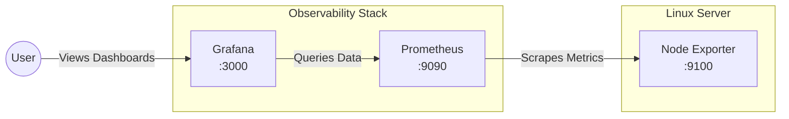

## Introduction to the Technology

In the modern landscape of distributed systems and microservices, visibility into system performance is no longer a luxury—it is a strict requirement. **Prometheus** and **Grafana** have emerged as the de facto open-source standard for observability and infrastructure monitoring. 

* **Prometheus** is a powerful time-series database and alerting system originally developed at SoundCloud. It operates on a "pull" model, scraping metrics from configured endpoints at regular intervals.
* **Grafana** is an open-source analytics and interactive visualization web application. It connects to Prometheus (and many other data sources) to create rich, dynamic dashboards.

Together, they provide real-time insights into server health, allowing engineers to proactively detect anomalies before they cause downtime.

---

## Why Monitoring Matters

Operating a system without monitoring is like driving a car blindfolded. Without actionable data, you cannot:
- Diagnose bottlenecks (CPU/RAM spikes).
- Anticipate capacity limits (disk space running out).
- Ensure high availability.
- Debug system failures retroactively.

---

## Architecture Diagram

Here is a high-level overview of how the components interact in this setup:



---

## Setup and Implementation Process

This lab walks through deploying the stack on a standard Linux environment (e.g., Ubuntu/Debian). We will install Node Exporter to gather system metrics, Prometheus to scrape and store them, and Grafana to visualize them.

### 1. Installing Node Exporter

Node Exporter runs on the target Linux machine and exposes hardware and OS metrics via an HTTP endpoint (`/metrics`).

```bash
# Download and extract Node Exporter
wget https://github.com/prometheus/node_exporter/releases/download/v1.7.0/node_exporter-1.7.0.linux-amd64.tar.gz
tar xvf node_exporter-1.7.0.linux-amd64.tar.gz

# Move binary to local bin
sudo cp node_exporter-1.7.0.linux-amd64/node_exporter /usr/local/bin/

# Create a dedicated system user
sudo useradd --no-create-home --shell /bin/false node_exporter
```

Create a systemd service file at `/etc/systemd/system/node_exporter.service`:

```ini
[Unit]
Description=Node Exporter
Wants=network-online.target
After=network-online.target

[Service]
User=node_exporter
Group=node_exporter
Type=simple
ExecStart=/usr/local/bin/node_exporter

[Install]
WantedBy=multi-user.target
```

Enable and start the service:
```bash
sudo systemctl daemon-reload
sudo systemctl enable --now node_exporter
```

### 2. Installing Prometheus

Next, install the core Prometheus server.

```bash
# Create user and directories
sudo useradd --no-create-home --shell /bin/false prometheus
sudo mkdir /etc/prometheus
sudo mkdir /var/lib/prometheus

# Download and install
wget https://github.com/prometheus/prometheus/releases/download/v2.45.0/prometheus-2.45.0.linux-amd64.tar.gz
tar xvf prometheus-2.45.0.linux-amd64.tar.gz
sudo cp prometheus-2.45.0.linux-amd64/prometheus /usr/local/bin/
sudo cp prometheus-2.45.0.linux-amd64/promtool /usr/local/bin/
sudo cp -r prometheus-2.45.0.linux-amd64/consoles /etc/prometheus
sudo cp -r prometheus-2.45.0.linux-amd64/console_libraries /etc/prometheus
```

### 3. Configuring Scrape Targets

We need to tell Prometheus to scrape the Node Exporter we just set up. Create `/etc/prometheus/prometheus.yml`:

```yaml
global:
  scrape_interval: 15s

scrape_configs:
  - job_name: 'prometheus'
    static_configs:
      - targets: ['localhost:9090']

  - job_name: 'linux_server'
    static_configs:
      - targets: ['localhost:9100']
```

Fix permissions and create the systemd service for Prometheus (`/etc/systemd/system/prometheus.service`):

```ini
[Unit]
Description=Prometheus
Wants=network-online.target
After=network-online.target

[Service]
User=prometheus
Group=prometheus
Type=simple
ExecStart=/usr/local/bin/prometheus \
    --config.file /etc/prometheus/prometheus.yml \
    --storage.tsdb.path /var/lib/prometheus/ \
    --web.console.templates=/etc/prometheus/consoles \
    --web.console.libraries=/etc/prometheus/console_libraries

[Install]
WantedBy=multi-user.target
```

```bash
sudo chown -R prometheus:prometheus /etc/prometheus /var/lib/prometheus
sudo systemctl daemon-reload
sudo systemctl enable --now prometheus
```

### 4. Installing Grafana

Install Grafana to create visually appealing dashboards.

```bash
sudo apt-get install -y apt-transport-https software-properties-common wget
sudo mkdir -p /etc/apt/keyrings/
wget -q -O - https://apt.grafana.com/gpg.key | gpg --dearmor | sudo tee /etc/apt/keyrings/grafana.gpg > /dev/null
echo "deb [signed-by=/etc/apt/keyrings/grafana.gpg] https://apt.grafana.com stable main" | sudo tee -a /etc/apt/sources.list.d/grafana.list

sudo apt-get update
sudo apt-get install grafana
sudo systemctl enable --now grafana-server
```

---

## Connecting Dashboards & Outputs

Once Grafana is running (accessible at `http://<server-ip>:3000`), log in (default: admin/admin) and add Prometheus as a Data Source via `Configuration -> Data Sources`. 

You can then import a pre-built dashboard (like the famous Node Exporter Full dashboard, ID `1860`) to instantly visualize CPU/RAM and disk IO.

> **Output Verification**: If everything is configured correctly, visiting `http://localhost:9100/metrics` in your terminal via `curl` will output a stream of raw metrics, verifying Node Exporter is successfully exposing system data.

---

## Applications and Benefits

1. **Proactive Incident Management:** Automatically trigger alerts (via Alertmanager) when memory usage exceeds 90% or disk space falls below 5GB.
2. **Capacity Planning:** Analyze historical time-series data to decide when to scale up server resources.
3. **Performance Tuning:** Correlate CPU spikes with specific scheduled jobs or traffic patterns.
4. **Unified Observability:** Grafana acts as a single pane of glass, capable of integrating Prometheus metrics alongside logs from Loki and traces from Tempo.

---

## Challenges Faced

During the implementation, several technical hurdles were encountered:
- **Port Conflicts:** Ensuring ports 9090 (Prometheus), 9100 (Node Exporter), and 3000 (Grafana) were open on the firewall and not occupied by other services.
- **Permissions:** Prometheus relies heavily on strict file permissions. Incorrect ownership of `/var/lib/prometheus` caused the service to crash upon starting.
- **Data Retention Constraints:** Prometheus stores data locally. By default, it can consume a lot of disk space. Figuring out how to configure retention flags (`--storage.tsdb.retention.time=15d`) was crucial for a stable long-term setup.

---

## Technology Awareness & Future Scope

The observability landscape is rapidly evolving. While the Prometheus-Grafana stack is an industry standard, the future is moving toward **OpenTelemetry (OTel)**. OpenTelemetry provides a unified standard for metrics, logs, and traces, allowing organizations to avoid vendor lock-in. 

Furthermore, cloud-native environments are increasingly adopting **Thanos** or **Cortex** on top of Prometheus to provide long-term, highly available, and scalable metric storage backed by cloud object storage (like S3).

## References

- [Prometheus Official Documentation](https://prometheus.io/docs/introduction/overview/)
- [Grafana Installation Guide](https://grafana.com/docs/grafana/latest/setup-grafana/installation/debian/)
- [Node Exporter GitHub Repository](https://github.com/prometheus/node_exporter)
